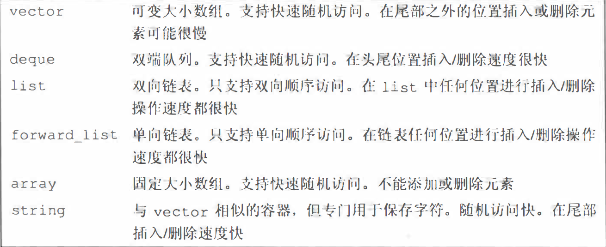
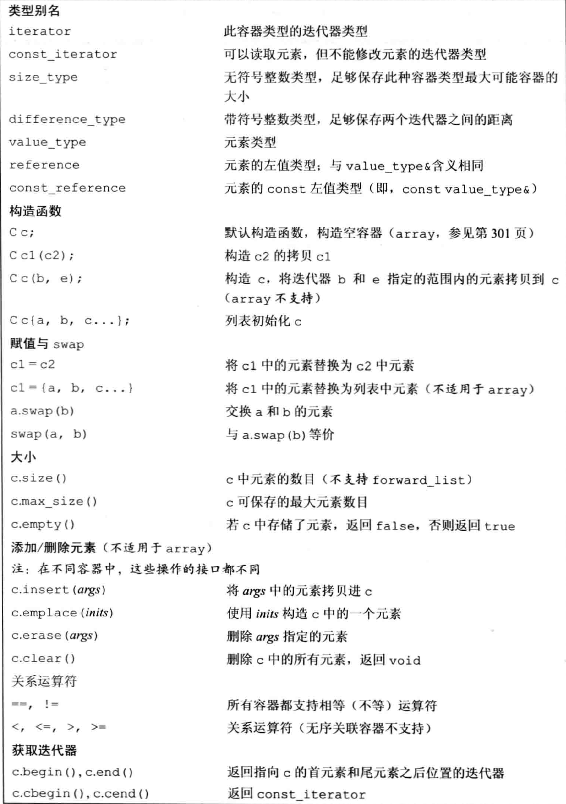
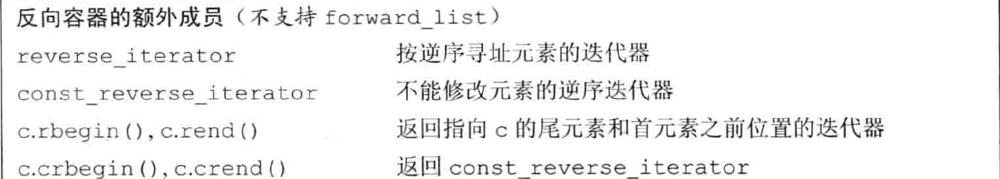
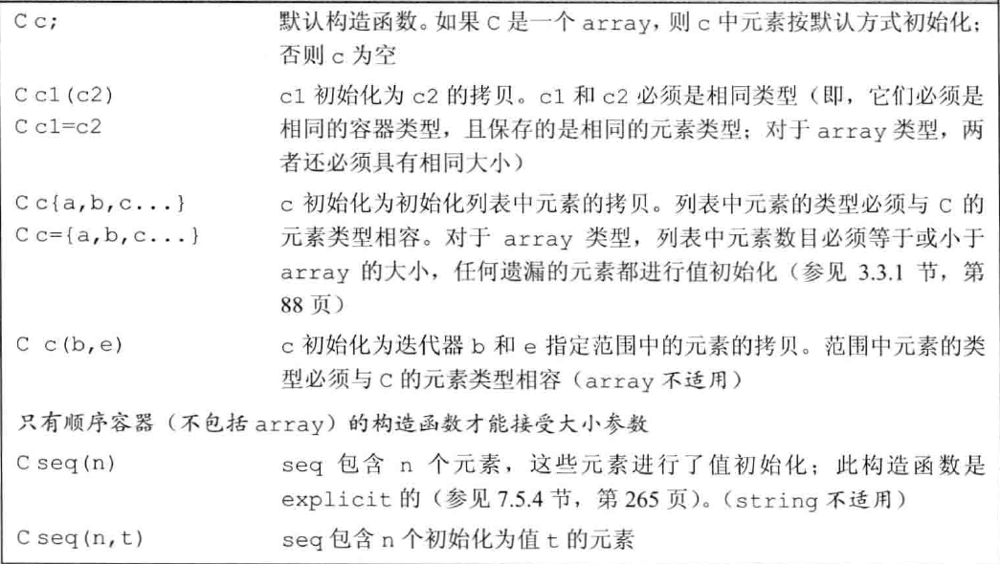
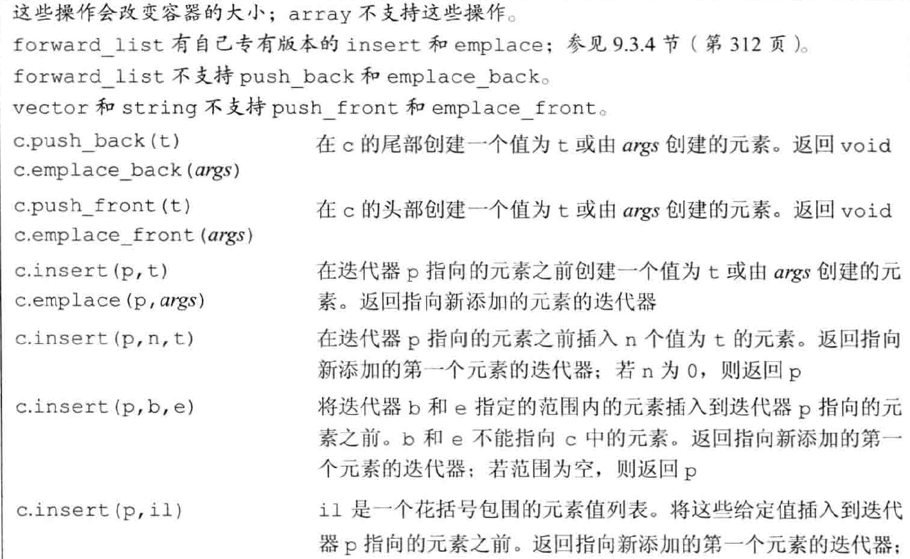
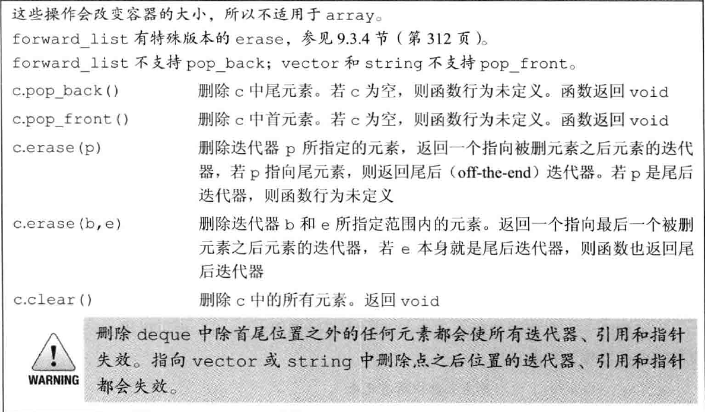
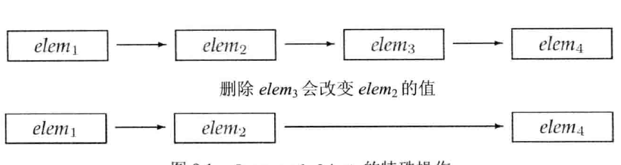
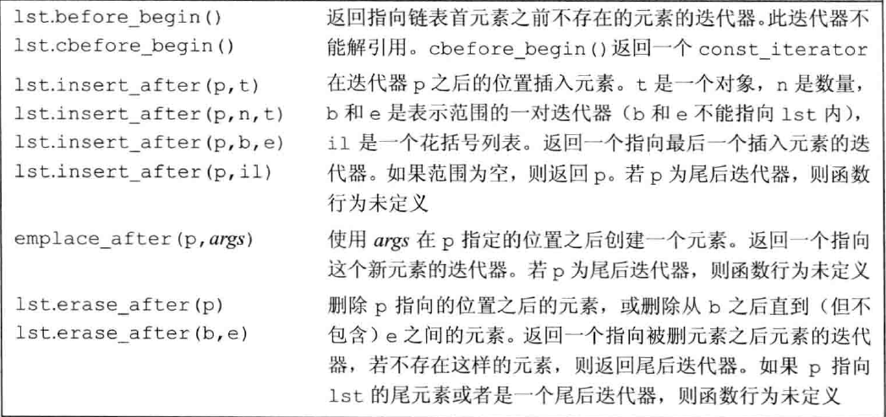
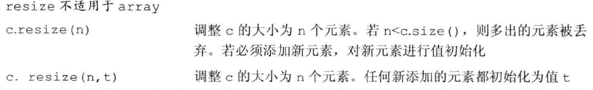
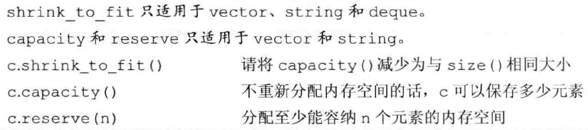

# <center> 第九章: 顺序容器

<a id="markdown-center-第九章-顺序容器" name="center-第九章-顺序容器"></a>

---

<!-- TOC -->

- [ 第九章: 顺序容器](#-第九章-顺序容器)
	- [1. 顺序容器概述](#1-顺序容器概述)
		- [1.1. 各自的折中方案](#11-各自的折中方案)
		- [1.2. 选择容器的原则](#12-选择容器的原则)
	- [2. 容器库概览](#2-容器库概览)
		- [2.1. 容器库](#21-容器库)
		- [2.2. 对容器保存的元素的限制](#22-对容器保存的元素的限制)
		- [2.3. 容器库操作](#23-容器库操作)
		- [2.4. 迭代器](#24-迭代器)
		- [2.5. 容器类型成员](#25-容器类型成员)
		- [2.6. 类型别名](#26-类型别名)
		- [2.7. begin 与 end](#27-begin-与-end)
		- [2.8. 容器定义与初始化](#28-容器定义与初始化)
		- [2.9. 赋值与 swap](#29-赋值与-swap)
			- [2.9.1. 基本大概](#291-基本大概)
			- [2.9.2. 赋值使得迭代器和引用失效](#292-赋值使得迭代器和引用失效)
			- [2.9.3. 使用 assign](#293-使用-assign)
			- [2.9.4. swap](#294-swap)
		- [2.10. 容器大小操作(成员函数)](#210-容器大小操作成员函数)
		- [2.11. 关系运算符](#211-关系运算符)
	- [3. 顺序容器操作](#3-顺序容器操作)
		- [3.1. push\_back()](#31-push_back)
		- [3.2. push\_front](#32-push_front)
		- [3.3. insert](#33-insert)
		- [3.4. emplace](#34-emplace)
		- [3.5. 访问元素](#35-访问元素)
		- [3.6. 下标随机访问](#36-下标随机访问)
		- [3.7. 删除元素](#37-删除元素)
			- [3.7.1. pop\_front 与 pop\_back](#371-pop_front-与-pop_back)
			- [3.7.2. erase](#372-erase)
			- [3.7.3. forward\_list 的删除](#373-forward_list-的删除)
			- [3.7.4. 顺序容器改变大小](#374-顺序容器改变大小)
			- [3.7.5. 迭代器,引用失效](#375-迭代器引用失效)
		- [3.8. 顺序容器成员函数使用](#38-顺序容器成员函数使用)
			- [3.8.1. 利用返回的迭代器](#381-利用返回的迭代器)
			- [3.8.2. end 失效](#382-end-失效)
		- [3.9. 管理容量](#39-管理容量)
			- [3.9.1 reserve](#391-reserve)
			- [3.9.2 capacity 与 size](#392-capacity-与-size)

<!-- /TOC -->

---

## 1. 顺序容器概述

<a id="markdown-顺序容器概述" name="顺序容器概述"></a>

容器就是以些特定类型对象的集合, **顺序容器**(sequential container)为程序员提供了控制元素存储和访问顺序的能力. 这种顺序不依赖于元素的值, 而是与元素加入容器时的位置相对应. 与之相对的.
标准库提供了以下的顺序容器, 他们都支持顺序访问, 不过在随机访问和增添删除中有各自的折中方案



### 1.1. 各自的折中方案

<a id="markdown-各自的折中方案" name="各自的折中方案"></a>

1. **string** 和 **vector** 在内存中是连续分布的,因此随机访问很快,但是插入元素就相对较慢了(因为如果要插入一个元素,则后面的元素都要移动).

1. 相对应的,**list** 和 **forward_list** 插入元素很快,但是不能随机访问,有时为了访问一个元素,要遍历整个容器,而且他们的内存开销也比 vector 和 string 大.

1. **deque**(双端队列)也能随机访问(可能也慢),但是在开头和尾部插入删除却很快.

1. **array** 是 c++11 新的类型,与内置的数组类似,大小固定,但是 array 更加安全易用.创建一个 array 对象时除了类型还有提供大小.第一个参数提供类型,第二个提供数组大小:array<int,3>
1. 对于 forward_list 而言,其创造是为了能够达到和手写的单向列表相同的性能,并且由于保存和计算单向列表的大小会造成很多开销,因此 forward_list 没有 size()函数.而其他的容器都保证了 size()是一个快速的操作.

### 1.2. 选择容器的原则

<a id="markdown-选择容器的原则" name="选择容器的原则"></a>

1. 除非有很好的理由选择其他容器,否则应使用 vector.
2. 如果你的程序有很多小的元素,且空间的额外开销很重要,则不要使用 list 或 forward_list.
3. 如果程序要求随机访问元素,应使用 vector 或 deque.
4. 如果程序要求在容器的中间插入或删除元素,应使用 list 或 forward_list.如果程序需要在头尾位置插入或删除元素,但不会在中间位置进行插入或删除操作,则使用 deque.
5. 如果程序只有在读取输入时才需要在容器中间位置插入元素随后需要随机访问元素,则

- 首先, 确定是否真的需要在容器中间位置添加元素. 当处理输入数据时, 通常可以很容易地向 vector 追加数据, 然后再调用标准库的 sort 函数（我们将在 10.2.3 节介绍 sort（第 343 页)）来重排容器中的元素, 从而避免在中间位置添加元素.
- 如果必须在中间位置插入元素, 考虑在输入阶段使用 list, 一旦输入完成, 将 list 中的内容拷贝到一个 vector 中.
  如果既要随机访问又要插入元素, 则比较二者当中谁的使用机会比较多. 如果相差无几, 则需要单独测试不同容器的效率 xc
  如果不确定, 可以只使用 vector 和 list 进行公共操作, 使用迭代器而不是下标来避免随机访问.

## 2. 容器库概览

<a id="markdown-容器库概览" name="容器库概览"></a>

### 2.1. 容器库

<a id="markdown-容器库" name="容器库"></a>

除了顺序容器, 标准库还提供了关联容器和无序容器.
相对应的是容器操作, 所有容器有共同的操作, 一类容器有独特的操作, 而小部分容器有专属的操作.
一般来说, 每个容器都定义在和它们同名的头文件里. 而容器都是类模板, 大多数容器都需要提供额外的信息(类型)

```cpp
list<string> list1;//保存string的双向链表
deque<vector<double> >//保存类型为double的向量的双端队列
```

### 2.2. 对容器保存的元素的限制

<a id="markdown-对容器保存的元素的限制" name="对容器保存的元素的限制"></a>

顺序容器几乎可以保存所有类型, 一个容器的元素是另一个容器的定义和一般的没区别(但是有的编译器在两个右尖括号直接需要空格 > > ).
虽然可以在容器中保存几乎任何类型, 但某些容器操作对元素类型有其自己的特殊要求. 我们可以为不支持特定操作需求的类型定义容器, 但这种情况下就只能使用那些没有特殊要求的容器操作了.
例如, 顺序容器构造函数的一个版本接受容器大小参数, 它使用了元素类型的默认构造函数. 但某些类没有默认构造函数. 我们可以定义一个保存这种类型对象的容器, 但我们在构造这种容器时不能只传递给它一个元素数目参数

```cpp
//假定noDefault是一个没有默认构造函数的类型
vector<noDefault> v1(10, init);//正确:提供了元素初始化器
vector<noDefault> v2(10);//错误:必须提供一个元素初始化器
```

### 2.3. 容器库操作

<a id="markdown-容器库操作" name="容器库操作"></a>

容器库操作是容器库中的一些成员函数或者重载的符号, 帮助使用容器, 其中指针也是一种迭代器





### 2.4. 迭代器

<a id="markdown-迭代器" name="迭代器"></a>

迭代器有着公共的接口: 如果一个迭代器提供某个操作, 那么所有提供相同操作的迭代器对这个操作的实现方式都是相同的. 例如, 标准容器类型上的所有迭代器都允许我们访问容器中的元素, 而所有迭代器都是通过解引用运算符来实现这个操作的.

此外标准库容器的所有迭代器都定义了递增(递减)运算符, 从当前元素移动到下一个(上一个)元素, 但是 **forward_list::iterator 没有递减运算符**

迭代器的范围由一对指向同一个容器的迭代器表示, 其中一个指向第一个元素, 另一个指向尾后元素. 用成员函数 begin()和 end()来返回这两个迭代器. 由于**end 返回的类型是指向的是尾后元素的而不是尾元素的迭代器**, 因此迭代器范围是左闭合区间[begin, end). 这种左闭合区间可以带来以下三个方便的性质:

1. 如果 begin 与 end 相等,则范围为空
2. 如果 begin 与 end 不等,则范围至少包含一个元素,且 begin 指向该范围中的第一个元素
3. begin 递增若干次,使得 begin==end

又由于可能有的容器的迭代器没有定义<和>, 因此 **C++中迭代器循环常用!=来判断截止**

```cpp
vector<int> test{1,1,1,1,1};//列表初始化
vector<int>::iterator i1 = test.begin();
while (i1!=test.end())//用!=来判断
{
  *i1 = 0;
  cout << *i1 << " ";
  ++i1;
}
cout << endl;
```

### 2.5. 容器类型成员

<a id="markdown-容器类型成员" name="容器类型成员"></a>

除了表中介绍三个的容器操作, **iterator**, **size_type** 和 **const_iterator** 以外, 容器操作还有 **reserve_iterator** 反向迭代器(其操作和含义都会反着来, ++会得到上一个元素). 反向迭代器后面详细介绍

### 2.6. 类型别名

<a id="markdown-类型别名" name="类型别名"></a>

通过类型别名, 我们可以在不了解容器中元素类型的情况下使用它. 如果需要元素类型, 可以使用容器的 **value_type**. 如果需要元素类型的一个引用, 可以使用 **reference** 或 **const_reference**. 这些元素相关的类型别名在泛型编程中非常有用.(16 章介绍泛型编程)

```cpp
using pos=string::size_type;//这也许在其他地方或者文件里
vector<pos>::size_type i=1;//size_type可以得到容器里类型别名的实际类型,这里就是size_t
vector<pos>::reference r=i;//r是size_t &类型
vector<pos>::const_reference c_r=i;//c_r是const size_t &类型
```

### 2.7. begin 与 end

<a id="markdown-begin-与-end" name="begin-与-end"></a>

成员函数除了一般的 begin 和 end 返回 iterator 外, 还有**c**(const)与**r**(reserve)类型. 例如 test.cbegin()返回的就是 **const_iterator**(常量迭代器), 而 test.criterator 返回的则是 **const_reserve_iterator**(常量反向迭代器).

const_iterator 是 C++11 才出现的类型, 并且和其他常量类似, iterator 可以转换为 const_iterator , 但是**反之不行**.

此外 const_iterator 还支持 auto 自动推到出 test.cbegin()的返回类型如果容器时 const, 那么无论是 begin 还是 cbegin, auto 自动推到出的结果都是 **const_iterator**. 如果容器的元素是 const, 那么 cbegin 的推到结果是 const_iterator 而 begin 推到的结果是 iterator

当不需要写入时最后声明为 const_iterator, 或者使用 cbegin 和 cend.

```cpp
 vector<const int> test{1,2,3,4,5,6,7};
 auto i = test.cbegin();//i时const_iterator
 auto j = test.begin();//j时iterator
 const vector<int> test{1,2,3,4,5,6,7};
 auto k = test.cbegin();//k时const_iterator
 auto l = test.begin();//l时const_iterator
```

### 2.8. 容器定义与初始化

<a id="markdown-容器定义与初始化" name="容器定义与初始化"></a>

每个容器类型都定义了一个默认构造函数, 除了 array 以外的容器其他容器的默认构造函数都会创建一个指定类型的空容器, 且都可以接受指定容器大小和元素初始值的参数.



其中 C c(b, e)的范围拷贝元素与 C 中元素相容即可, 也就是被拷贝的容器元素可以转换为目标容器的原元素类型.
但是其中的 b 是拷贝区域的开头位置而 e 指向的是拷贝区别的**尾后元素**, 也就是**最后一个元素的下一个位置**

```cpp
list<string> authors = {"Milton", "Shakespeare", "Austen"};
vector<const char *> articles = {"a", "an", "the"};
list<string> list2(authors);     // 正确:类型匹配
deque<string> authList(authors); // 错误:容器类型不匹配
vector<string> words(articles);//错误:容器类型必须匹配
forward_list<string> words(articles.begin(), articles.end());
//正确:可以将const char*元素转换为string

vector<double> d1{1.1,2.1,3.1,4.1,5.1};
auto b = d1.begin();
auto e = d1.end();
++b;
--e;//现在e指向最后一个元素5.1
vector<int> i1(b, e);
for(auto &i:i1)
{
    cout << i << " ";
}
cout << endl;
//结果是2 3 4,说明e指向的5.1并没有被转换拷贝
```

除了()的拷贝初始化, 顺序容器(除了 array)还提供了值初始化, 也就是两个重载的构造函数, 其中一个接受两个参数, 第一个参数时容器的初始容量.
第二个参数是每一个元素的初始值. 另外一个版本的构造函数只接受一个参数作为初始容量, 而如果元素是内置类型或者有默认构造函数, 则会执行默认初始化或者默认构造函数. 如果没有默认构造函数, 则必须使用第一个版本.

```cpp
vector<int> ivec (10,-1) ;// 10个int元素,每个都初始化为-1
list<string>svec (10,"hi");// 10个strings;每个都初始化为"hi"
forward_list<int> ivec(10);// 10个元素,每个都初始化为0
deque<string> svec( 10 ) ;// 10个元素,每个都是空string

```

而由于 array 的固定大小, array 的构造函数比较特殊: 构造函数的参数和 array 的大小一样, 并且元素都会被默认初始化.
如果执行列表初始化, 则初始值数目必须小于等于数组大小, 没有被初始化的部分会被值初始化.
如果元素类型是类, 那么这个类必须有一个默认构造函数来执行初始化.

```cpp
array<int,10> ia1;// 10个默认初始化的int
array<int,10> ia2 = {0,1,2,3,4,5,6,7,8,9}; //列表初始化
array<int,10> ia3 = {42}; // ia3[0]为42,剩余元素为0
```

内置的数组不能进行赋值, 然而 **array 类型可以**

```cpp
int digs [10] = {0,1,2,3,4,5,6,7,8,9};
int cpy[10]= digs;//错误:内置数组不支持拷贝或赋值
array<int,10> digits = {0,1,2,3,4,5,6,7,8,9};
array<int,10> copy = digits;//正确:只要数组类型(元素类型与 大小 )匹配即合法
```

### 2.9. 赋值与 swap

<a id="markdown-赋值与-swap" name="赋值与-swap"></a>

#### 2.9.1. 基本大概

<a id="markdown-基本大概" name="基本大概"></a>

```cpp
c1=c2 //将c1 中的元素替换为c2中元素的拷贝.c1和c2必须具有相同的类型
c={a,b,c...}//将c1中元素替换为初始化列表中元素的拷贝.如果c是array类型,则把数组前几个替换为列表的内容
c1.swap(c2)//交换c1和c2中的元素
swap(c1,c2)//交换c1和c2中的元素.c1和c2必须具有相同的类型.swap通常比从c2向c1拷贝元素快得多
seq.assign (b,e)//将seq中的元素替换为迭代器b和e所表示的范围中的元素,包括b和e所指的元素.迭代器b和e不能指向seq中的元素,
seq.assign(il)//将seq中的元素替换为初始化列表i1中的元素
seq.assign (n, t)//将seq中的元素替换为n个值为t的元素
```

#### 2.9.2. 赋值使得迭代器和引用失效

<a id="markdown-赋值使得迭代器和引用失效" name="赋值使得迭代器和引用失效"></a>

**注意** : 赋值相关运算会导致指向左边容器内部的迭代器、引用和指针失效. 而 swap 操作将容器内容交换不会导致指向容器的迭代器、引用和指针失效容器类型为 array 和 string 的情况除外).

```cpp
vector<int> v1(4,0);
vector<int> v2(4,1);
int &k = v2[0];//赋值前引用
cout<<k<<endl;//k=1;
v2 = v1;//赋值后k失效
cout << k << endl;//k乱码
```

#### 2.9.3. 使用 assign

<a id="markdown-使用-assign" name="使用-assign"></a>

顺序容器(array 除外）还定义了一个名为 assign 的成员, 允许我们从一个不同但相容的类型赋值, 或者从容器的一个子序列赋值.assign 操作用参数所指定的元素(的拷贝）替换左边容器中的所有元素. 例如, 我们可以用 assgin 实现将一个 vector 中的一段 char \*值赋予一个 list 中的 string.assign 有三个重载函数

```cpp
list<string>names;
vector<const char*>oldstyle;
names = oldstyle; //错误:容器类型不匹配
names.assign (oldstyle.cbegin(), oldstyle.cend());//第一个重载,接受两个迭代器
//正确:可以将const char*转换为string
names.assign(3);//第二个重载,接受一个整形,三个元素,都是空string
names.assign(3,"OK");//第三个重载,接受一个整形和一个初始值.三个元素,都是:"OK"

```

#### 2.9.4. swap

<a id="markdown-swap" name="swap"></a>

swap 操作交换两个相同类型容器的内容. 调用 swap 之后, 两个容器中的元素将会交换. 除 array 外, swap 不对任何元素进行拷贝、删除或插入操作, 因此可以保证在常数时间内完成.

```cpp
vector<int> v1(3, 0);
vector<int> v2(3, 1);
auto ite1 = v1.begin();
auto ite2 = v2.begin();
cout << *ite1 << " " << *ite2 << endl;
//0 1
swap(v1, v2);
//交换后ite1指向v2[0]而ite2指向v1[0]
cout << *ite1 << " " << *ite2 << endl;
//0 1
```

除 array 外, swap 不对任何元素进行拷贝, 删除或插入操作, 因此可以保证在常数时间内完成. 实际上元素不会被移动
除了 string 以外, 调用 swap 不会使得迭代器和引用失效.
这意味着, 除 string 外, 指向容器的迭代器、引用和指针在 swap 操作之后都**不会失效**. 它们仍指向 **swap 操作之前**所指向的那些元素. 但是, 在 swap 之后, 这些元素已经属于不同的容器了.
与其他容器不同,swap 两个 array 会真正交换它们的元素. 因此,交换两个 array 所需的时间与 array 中元素的数目成正比.
由于 c++11 提供了非成员版本的 swap, 并且该版本在泛型编程中很重要, 因此统一使用非成员版本是一个好习惯.

### 2.10. 容器大小操作(成员函数)

<a id="markdown-容器大小操作成员函数" name="容器大小操作成员函数"></a>

1. size 返回容器中元素数目,forward_list 不支持该函数
2. empty 返回 bool 值,如果容器为空返回 true,反之返回 false.
3. max_size 返回该容器的最大容量

### 2.11. 关系运算符

<a id="markdown-关系运算符" name="关系运算符"></a>

每个容器类型都支持相等运算符(==和!=).
只有容器的元素类型也定义了比较运算符时, 容器才能使用比较运算符
除了无序关联容器外的所有容器都支持关系运算符(>、>=、<、<=).
关系运算符左右两边的运算对象必须是相同类型的容器,且必须保存相同类型的元素.
比较规则(类似 string 的比较):

1. 如果两个容器具有相同大小且所有元素都两两对应相等,则这两个容器相等;否则两个容器不等.
2. 如果两个容器大小不同,但较小容器中每个元素都等于较大容器中的对应元素,则较小容器小于较大容器.
3. 如果两个容器都不是另一个容器的前缀子序列,则它们的比较结果取决于第一个不相等的元素的比较结果.

## 3. 顺序容器操作

<a id="markdown-顺序容器操作" name="顺序容器操作"></a>

**注意: 向一个 vector、 string 或 deque 插入元素会使所有指向容器的迭代器引用和指针失效.**
此外, 用对象初始化或者插入到容器中时, 实际上放入容器中的是对象的拷贝而不是对象本身. 因此容器元素的改变不会影响对象本身.



当使用这些操作时,必须记得不同容器使用不同的策略来分配元素空间,而这些策略直接影响性能.在一个 vector 或 string 的尾部之外的任何位置,或是一个 deque 的首尾之外的任何位置添加元素,都需要移动元素.而且,向一个 vector 或 string 添加元素可能引起整个对象存储空间的重新分配.重新分配一个对象的存储空间需要分配新的内存,并将元素从旧的空间移动到新的空间中.

### 3.1. push_back()

<a id="markdown-pushback" name="pushback"></a>

push_back 将一个元素追加到一个 vector 的尾部.除了 array 和 forward_list 之外,每个顺序容器（包括 string 类型)都支持 push_back.

```cpp
//从标准输入中读取单词并输入到容器(包括vector,list和deque)尾部
string word;
while (cin >> word)
container.push back(word);
//也可以向string末尾加入一个字符
word.push_back('e');//相当于word+='e';
```

### 3.2. push_front

<a id="markdown-pushfront" name="pushfront"></a>

list, forward_list 和 deque 支持 push_front, 把元素插入到容器首个位置之前, 使之成为新的开始.
deque 和 string 都支持随机访问但是 string 不支持 push_front.

### 3.3. insert

<a id="markdown-insert" name="insert"></a>

insert 函数更具有普遍性, 它可以在如何位置插入数据, insert 有四个重载函数.

1. insert(position,t) : 单个插入 : 接受一个迭代器和一个值,把 t 插入到 iterator 前面一个位置,返回指向新添元素的迭代器
2. insert(p,n,t) : 连续插入 : 在迭代器 p 指向的元素之前插入 n 个值为 t 的元素.返回指向新添加的第一个元素的迭代器;若 n 为 0,则返回 p
3. insert (p,b,e) : 范围插入 : 将迭代器 b 和 e 指定的范围内的元素插入到迭代器 p 指向的元素之前(不包括 e 所指的元素).b 和 e 不能指向调用者中的元素.返回指向新添加的第一个元素的迭代器:若范围为空(b 和 e 指向同一个元素),则返回 p
4. c.insert (p,il) : 列表插入 : il 是一个花括号包围的元素值列表.将这些给定值插入到迭代器 p 指向的元素之前.返回指向新添加的第一个元素的迭代器;若列表为空,则返回 p

虽然有的容器不支持 push_front, 但是可以使用 insert 和 begin 来在首元素前插入元素

```cpp
vector<int> v1{1,2};
vector<int> v2(4,0);
//利用begin和insert在不支持push_front的容器前插入元素
//单个插入
v1.insert(v1.begin(),0);//0 1 2
//范围插入
v1.insert(v1.begin(),v2.end()-2,v2.end());//0 0 1 2
//列表插入
v1.insert(v1.begin(),{0,0,0})//0 0 0 1 2
//连续插入
v1.insert(v1.end(),2,0)//1 0 0 2

```

由于 insert 函数返回的是指向(第一个)新元素的迭代器, 因此可以利用这点实现位置连续而内容不连续的插入.

```cpp
list<string> lst;
auto iter = lst.begin ();
while (cin >>word)
   iter = lst.insert (iter,word); //等价于反复调用push_front
```

### 3.4. emplace

<a id="markdown-emplace" name="emplace"></a>

不同于 push 和 insert 调用时将对象到容器中, emplace 系列是把参数传递给元素类型的构造函数, 然后直接在内存中构造元素.
并且, emplace 会根据传入的参数不同而调用不同构造函数
emplace_front, emplace, emplace_back 在功能上分别对应 push_front, insert 和 push_back.

```cpp
//在c的末尾构造一个Sales_data对象
c.push_back("978-0590353403",25,15.99);//错误:没有接受三个参数的push back版本
c.push_back (Sales_data("978-0590353403",25,15.99) ) ;//正确:创建一个临时的Sales_data对象传递给push_back
c.emplace_back("978-0590353403",25,15.99);//使用三个参数的Sales data构造函数
c.emplace_back();//调用默认构造函数
```

### 3.5. 访问元素

<a id="markdown-访问元素" name="访问元素"></a>

顺序容器都有 front 成员函数(返回第一个元素的引用), 除了 forward_list 以外都有 bcak 成员函数(返回最后一个元素的引用), 如果容器时 const, 那么返回的就是常量引用. 因此 auto 自动推断时也要使用引用

```cpp
vector<int> v1{1,2,3,4,5,6};
auto &i1=v1.front();
i1=0;//成功改变
auto i2=v1.front();
i2=0;//i2获得的只是拷贝的数值
```

### 3.6. 下标随机访问

<a id="markdown-下标随机访问" name="下标随机访问"></a>

提供快速随机访问的容器（string、 vector、deque 和
array)也都提供下标运算符.就像我们已经看到的那样,下标运算符接受一个下标参数,返回容器中该位置的元素的引用.给定下标必须“在范围内”(即,大于等于 0,且小于容器的大小, 编译器不会检查)
如果我们希望确保下标是合法的,可以使用 at 成员函数.at 成员函数类似下标运算符,但如果下标越界,at 会抛出一个 out_of_range 异常

```cpp
vector<int> v1{1,2,3,4};
cout<<v1.at(0);//no problem
cout<<v1.at(5);//cerr:out of range
```

### 3.7. 删除元素

<a id="markdown-删除元素" name="删除元素"></a>

**注意: 这些函数并不会检查参数指向的位置是否存在**



#### 3.7.1. pop_front 与 pop_back

<a id="markdown-popfront-与-popback" name="popfront-与-popback"></a>

pop_front 和 pop_back 成员函数分别删除首元素和尾元素.**vector 和 string 不支持 pop_front,forward_list 不支持 pop_back**
这些操作返回 void.如果你需要弹出的元素的值,就必须在执行弹出操作之前保存它.

#### 3.7.2. erase

<a id="markdown-erase" name="erase"></a>

成员函数 erase 从容器中指定位置删除元素.我们可以删除由一个迭代器指定的单个元素,也可以删除由一对迭代器指定的范围内的所有元素.两种形式的 erase 都返回指向删除的(最后一个)元素之后位置的迭代器, 若 j 是 i 之后的元素,那么 erase(i)将返回指向 j 的迭代器.

```cpp
vector<int> v{1,2,3,4};
auto i1=v.bening();
auto i2=v.end();
v.erase(i1);//删除第一个元素,返回指向第二个元素的迭代器,i1也指向第二个元素
v.erase(i1,i2);//删除所有元素,等价于v.clear
```

#### 3.7.3. forward_list 的删除

<a id="markdown-forwardlist-的删除" name="forwardlist-的删除"></a>

由于单向列表的结构特殊性(删除一个元素会导致前面的元素指针域被改变).



因此 forward_list 定义了特殊的删除函数, 其中前驱是指这个元素的上一个元素



例如,在我们的例子中,为了删除 elem; ,应该用指向 elem, 的迭代器调用 erase_after.为了支持这些操作,forward_list 也定义了 before_begin,它返回一个 **首前( off-the-beginning)迭代器**.这个迭代器允许我们在链表首元素之前并不存在的元素“之后”添加或删除元素(亦即在链表首元素之前添加删除元素).

```cpp
forward_list<int> flst = {0, 1, 2, 3, 4, 5, 6, 7, 8, 9};
auto prev = flst.before_begin();
auto curr = flst.begin();
while (curr != flst.end())
{
  if (*curr % 2)
      curr = flst.erase_after(prev);
  // 通过prev删除当前的curr,然后函数返回后一个的迭代器赋给curr,相当于向后移动curr
  else
  {
      prev = curr;
      //prev指向当前curr的元素,然后移动迭代器curr,指向下一个元素
      ++curr;
  }
}
```

#### 3.7.4. 顺序容器改变大小

<a id="markdown-顺序容器改变大小" name="顺序容器改变大小"></a>

resize 用于改变容器的大小, 改变规则:

- 如果新容量小于原容量, 则多余的部分会被删除

* 如果新容量大于原容量且不传递初始化数据, 则多余的部分会值初始化



```cpp
list<int> ilist (10,42);// 10个int:每个的值都是42
ilist.resize(15);    	//将5个值为0的元素添加到ilist的末尾
ilist.resize (25,-1);  //将10个值为-1的元素添加到ilist的末尾
ilist.resize (5);      //从ilist末尾删除20个元素
```

**如果 resize 缩小容器,则指向被删除儿素的迭代器, 引用和指针都会失效**

#### 3.7.5. 迭代器,引用失效

<a id="markdown-迭代器引用失效" name="迭代器引用失效"></a>

**添加元素后:**

- 如果容器是 vector 或 string,且存储空间被重新分配,则指向容器的迭代器、指针和引用都会失效.如果存储空间未重新分配,指向插入位置之前的元素的迭代器、指针和引用仍有效,但指向插入位置之后元素的迭代器、指针和引用将会失效.
- 对于 deque,插入到除首尾位置之外的任何位置都会导致迭代器、指针和引用失效.如果在首尾位置添加元素,迭代器会失效,但指向存在的元素的引用和指针不会失效.
- 对于 list 和 forward_list,指向容器的迭代器（包括尾后迭代器和首前迭代器)、指针和引用仍有效.

**删除元素后:**

- 对于 list 和 forward list,指向容器其他位置的迭代器（包括尾后迭代器和首前迭代器)、引用和指针仍有效.
- 对于 deque,如果在首尾之外的任何位置删除元素,那么指向被删除元素外其他元素的迭代器、引用或指针也会失效.如果是删除 deque 的尾元素,则尾后迭代器也会失效,但其他迭代器、引用和指针不受影响;如果是删除首元素,这些也不会受影响.
- 对于 vector 和 string,指向被删元素之前元素的迭代器
  引用和指针仍有效.

**注意:当我们删除元素时,尾后迭代器总是会失效.**

**建议:在每次改变容器容量后都重新定位迭代器**

### 3.8. 顺序容器成员函数使用

<a id="markdown-顺序容器成员函数使用" name="顺序容器成员函数使用"></a>

#### 3.8.1. 利用返回的迭代器

<a id="markdown-利用返回的迭代器" name="利用返回的迭代器"></a>

- insert 系列返回的是指向插入的(第一个)元素的迭代器,可以用于迭代器
- erase 系列返回指向删除的元素的后一个元素的迭代器,可以用于重定位迭代器

```cpp
vector<int> vi{1,2,3};
auto iter=vi.begin();
iter = vi.insert (iter, *iter) ; //复制当前元素:1 1 2 3
iter += 2;//向前移动迭代器,跳过当前元素以及插入到它之前的元素
iter = vi.erase(iter);//不应向前移动迭代器,iter指向我们删除的元素之后的元素
```

#### 3.8.2. end 失效

<a id="markdown-end会失效" name="end失效"></a>

向添加或者删除 string,vector 中的元素后,或者在 deque 除了首尾以外的地方添加删除元素,都会导致**原来保存 end()的迭代器失效**.
因此在使用中改变容器大小后,重新定位保存 end 的迭代器

```cpp
vector<int> v(10,1);
auto i1=v.begin();
auto i2=v.end();
while(i1!=v.end())//每次插入后v.end返回的值都会重新定位
{
	//process code
	++i1;//在前面插入元素
	i1=v.insert(i1,3);//插入后i2失效
	++i1;//跳过插入的元素
}
```

### 3.9. 管理容量

<a id="markdown-管理容量" name="管理容量"></a>

为了在每次插入时不重新分配内存,vector 在创立时实际上分配的内存要比初始化的大.因此标准库中有一些函数可以用于查询容量


#### 3.9.1 reserve

reserve 并不改变容器中元素的数量,它仅影响 vector 预先分配多大的内存空间.
只有当需要的内存空间超过当前容量时,reserve 调用才会改变 vector 的容量

- 如果需求大小大于当前容量,reserve 至少分配与需求一样大的内存空间（可能更大).
- 如果需求大小小于或等于当前容量,reserve 什么也不做.特别是,当需求大小小于当前容量时,容器不会退回内存空间.因此,在调用 reserve 之后,capacity 将会大于或等于传递给 reserve 的参数.

#### 3.9.2 capacity 与 size

**容 size 是指它已经保存的元素的数目
而 capacity 则是在不分配新的内存空间的前提下它最多可以保存多少元素**

```cpp
vector<int> v;
cout<<v.size()<< endl;// 0
cout << v.capacity()<<endl;//依赖于具体的实现
for (int i = 0; i < 10;++i)
{
    v.push_back(i);
}
cout << v.capacity() << " " << v.size() << endl;
//16 10
```
由于我们只使用了预留空间，因此没有必要为vector分配新的空间。实际上，只要没有操作需求超出vector的容量，vector就不能重新分配内存空间。
如果需要超出已有,则编译器会分配内存且比多需要的要大
