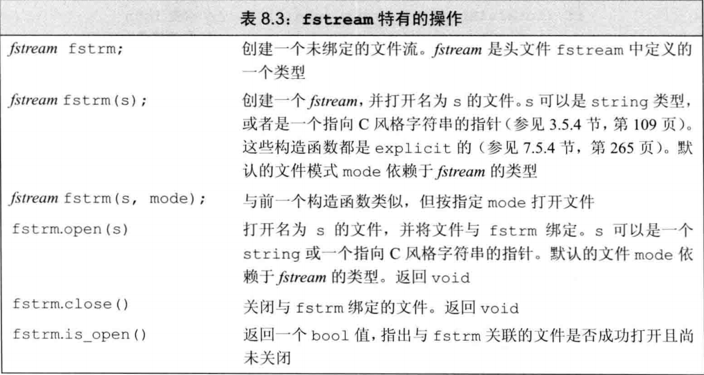
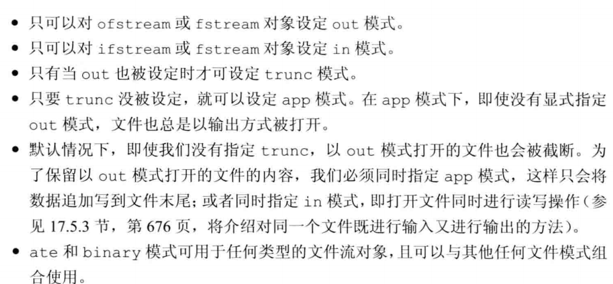
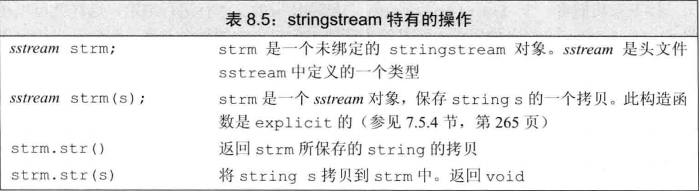

# <center> 第八章: IO 库

---

<!-- TOC -->

- 1. IO 类
  - 1.1. IO 中无拷贝和赋值
  - 1.2. 条件状态
  - 1.3. 管理输出缓冲
- 2. :文件输入输出
  - 2.1. :使用文件流
    - 2.1.1. 读写文件操作
    - 2.1.2. 继承机制的函数参数传递代替
    - 2.1.3. 成员函数 open 与 close
    - 2.1.4. 自动构造与析构
  - 2.2. :文件模式
    - 2.2.1. 只以 out 模式打开会丢弃已有数据
- 3. string 流
  - 3.1. 使用 istringstream
  - 3.2. : 使用 ostringstream
- 4. 小结

<!-- /TOC -->

## 1. IO 类

为了支持不同的 IO 操作,C++标准库中除了 **iostream**(标准输入输出)以外,还提供了 **fstream**(文件)和 **sstream**(字符串).他们被包含在各自的头文件中

| 头文件   |                    类型                    |
| -------- | :----------------------------------------: |
| iostream |          istream,ostream,iostream          |
| fstream  |        ifstream,ofstream,iofstream         |
| sstream  | istringstream,ostringstream,iostringstream |

此外,为了支持使用宽字符的语言，标准库定义了一组类型和对象来操纵 **wchar_t** 类型的数据。宽字符版本的类型和函数的名字以一个 w 开始。例如，wcin、wcout 和 wcerr 是分别对应 cin、cout 和 cerr 的宽字符版对象。宽字符版本的类型和对象与其对应的普通 char 版本的类型定义在同一个头文件中。例如，头文件 fstream 定义了 ifstream 和 wifstream 类型。
由于特殊的机制(继承机制),所有的输入都可以使用>>来进行,无论是从窗口,string 或者一个文件中读入,还是读取字符或者宽字符.
具体来说,继承机制可以使我们声明一个类继承来自另一个类,前者叫做派生类(子类),后者叫做基类(父类).而 C++中,fstream 和 sstream 都是 iostream 的派生类,因此可以使用 cin 从 ifsteram(文件输入流)中读取数据

---

### 1.1. IO 中无拷贝和赋值

```cpp
ofstream out1, out2;out1 =out2;//错误:不能对流对象赋值
ofstream print (ofstream) ;//错误:不能初始化ofstream参数
out2 = print (out2);//错误:不能拷贝流对象

```

由于 IO 中没有拷贝和赋值,因此函数中返回值,参数只能是**流引用类型**,不能是流.并且读写流会改变其状态,因此也**不能是 const**

### 1.2. 条件状态

io 可能会发生一些错误,一些错误是可以恢复的,而一些错误发生在系统内部,已经超出可以修正的返回,io 库定义了一个与机器无关的 iostate 类型,包含四个 constexpr 值(位模式),以及一些查询这些状态的函数


一个使用例子:

```cpp
auto old_state = cin.rdstate(); //记住cin的当前状态
cin.clear ();//使cin有效
process_input (cin) ;//使用cin
cin.setstate(old_state);//将cin置为原有状态
```

一个 io 错误的例子:

```cpp
ina ival;
cin>>ival;
```

如果我们在输入中输入 zero,或者是文件结束标志符,当 cin 读取一个,那么这个 cin 的读取就会错误,进入错误状态(上表),因为 cin 输入的对象 int 而我们输入的是 char 类型
一个流一旦发生错误，其上**后续的 IO 操作都会失败**。只有当一个流处于无错状态时，我们才可以从它读取数据，向它写入数据。由于流可能处于错误状态，因此代码通常应该在使用一个流之前检查它是否处于良好状态。确定一个流对象的状态的最简单的方法是将它当作一个条件来使用:

```cpp
while(cin>>ival)
```

while 循环检查表达式返回的流的状态。如果输入操作成功，流保持有效状态，则条件为真。

### 1.3. 管理输出缓冲

由于设备的写操作可能很耗时,因此允许系统把多个输出操作合一输出.因此才出现缓冲区.当调用输出时,可能不会立即在输出在显示屏上,而是存放在输出缓冲区,当缓冲区满了或者遇到刷新缓冲命令(例如 endl,flush)就会在屏幕上显示输出.

```cpp
cout << "hi! " <<endl;//输出hi和一个换行,然后刷新缓冲区
cout << "hi!" << flush;//输出hi,然后刷新缓冲区,不附加任何额外字符
cout << "hi! " <<ends;//输出hi和一个空字符,然后刷新缓冲区

```

**unitbuf** 操纵符:每次输出操作后都刷新缓冲区(用 flush).而 **nounitbuf** 操纵符则重置流，使其恢复使用正常的系统管理的缓冲区刷新机制

```cpp
cout << unitbuf;//任何输出都立即刷新(使用flush)，无缓冲
cout << nounitbuf;//回到正常的缓冲方式
```

此外流的关联也会导致刷新缓冲区,例如默认 cin 和 cerr 都是关联到 cout 上,当调用 cin 或者 cerr 时,cout 就会刷新缓冲区从而打印信息(交互式系统通常应该管理输入流和输出流)
**iostream** 中定义了 **tie** 作为关联的成员函数,有两个重载,一个不接受参数,如果没有对象关联到了输出流,那么 cin.tie 返回空指针,如果有,则返回指向关联到输出流的对象的流指针.还有一个版本时接受一个 ostream 流指针,把自己关联到 ostream 上

```cpp
cin.tie ( &cout);//把cin关联到cout上(标准库中已经默认)
// old_tie指向当前关联到cin的流（如果有的话)
ostream *old_tie = cin.tie (nullptr);//cin不再与其他流关联
cin.tie(&cerr);//将cin与 cerr关联;这不是一个好主意，因为cin应该关联到cout.读取cin会刷新cerr而不是cout
cin.tie(old_tie);//重建cin和cout间的正常关联

```

**注意:当程序 异常终止时,缓冲区并不会被刷新,程序输出的数据还可能停留在缓冲区.因此调试一个崩溃的程序时,需要确认缓冲区是否已经刷新**

---

## 2. :文件输入输出

头文件 **fstream** 定义了三个类型来支持文件 IO:**ifstream** 从一个给定文件读取数据，**ofstream** 向一个给定文件写入数据，以及 **fstream** 可以读写给定文件(后面介绍)。在 8.1 节中介绍的条件状态在文件流中也适用,**getline** 也可以从文件流中读取一行字符串.此外文件流还有一些特殊特有的操作


### 2.1. :使用文件流

#### 2.1.1. 读写文件操作

定义一个文件流对象，并将对象与文件关联起来。每个文件流类都定义了一个名为 **open** 的成员函数，它完成一些系统相关的操作，来定位给定的文件，并视情况打开为读或写模式。

```cpp
ifstream in (ifile);//构造一个ifstream并打开给定文件
ofstream out;//输出文件流未关联到任何文件
```

其中 ifile 是文件名,C++11 后文件名除了是文件以外,还可以是 string 对象或者是 C 语言风格的字符串

#### 2.1.2. 继承机制的函数参数传递代替

fstream 在函数传递参数时,可以代替 iostream 的引用类型传递给函数.(继承机制),例如一个函数的参数时 ostream&,我们可以用 ofstream 传递给这个函数,输入流也是一样的.

#### 2.1.3. 成员函数 open 与 close

定义了流对象以后,可以用成员函数 open 来使流和文件(或者是其他对象)关联起来.除了 open,也可以以一个文件名来初始化文件流的方式打开.

```cpp
ifstream in;//构造一个ifstream对象
in.open(ifile);//in与ifile关联
ofstream out("D:/Desktop/out.txt");//使用文件名初始化文件流
```

如果调用 open 失败，failbit 会被置位([8.1.2](8.1.2)的条件状态)
因为调用 open 可能失败，进行 open 是否成功的检测通常是一个好习惯

```cpp
ofstream out;
out.open(ifile);
if (out)//检查open是否成功
{
    //CODE
}
```

如果 open 打开失败,则 out 的 iostate 将会被 failbit 置位.if 判断会把 iostream::iostate 转换为 bool 判断是否打开成功
一旦 open 打开成功,则会一直关联,此时在调用 open 就会失败,随后的文件流操作都会失败.因此在把文件流关联到另一个文件之前,**必须先关闭已经关联的文件**.

```cpp
out.close();//关闭已经关联的头文件
out.open(another_file);//如果关联成功,则流状态good()就会被open设置为true
```

#### 2.1.4. 自动构造与析构

在局部中创立的 fstream 对象,当离开其作用域(进行下一次循环或者退出循环)时,会销毁该对象,在销毁时会自动调用 close()函数关闭已经关联的文件.

```cpp
for (auto p= argv + l; p != argv + argc; ++p)
{
ifstream input ( *p);//创建输出流并打开文件
    if (input)
    {   //如果文件打开成功，“处理”此文件
        /*process code*/
    } else
        cerr << "couldn't open : " + string(*p);
}//每个循环步input都会离开作用域，因此会被销毁

```

### 2.2. :文件模式

每个流都有一个关联的文件模式,用来指定如何使用文件

**但是文件模式有以下的限制**

此外,每个文件流类型都定义了一个**默认的文件模式**，当未指定文件模式时，就使用此默认模式:
ofstream->out ifstream->in fstream->in 和 out

#### 2.2.1. 只以 out 模式打开会丢弃已有数据

由于默认情况下,ofstream 是以 out 方式打开文件.此时该文件内**旧的数据都会被删除**,新写的数据会从头开始.

```cpp
//在这几条语句中，file1都被截断.
ofstream out("file1");//隐含以输出模式打开文件并截断文件
ofstream out2 ("file1",ofstream::out); //隐含地截断文件
ofstream out3 ("file1", ofstream::out | ofstream::trunc) ;
```

因此如果要保留原有的数据,必须**显式地指定 app 模式**.

```cpp
//为了保留文件内容，我们必须显式指定app模式
ofstream app ("file2", ofstream::app);// 隐含为输出模式
ofstream app2("file2",ofstream ::out | ofstream ::app);
```

最后一点是.每次打开都要指定文件模式,上一次打开的文件模式不会保留到下一次,如果不指定,则为默认的文件模式.

## 3. string 流

在 iostream 中定义了 isstringstream,ostringstream 和 stringstream 来执行字符串流的输入,输出和输入输出.此外 stringstream 流来定义了一些独有的操作


### 3.1. 使用 istringstream

当处理整行里的单词时,通常使用 istringstream.

```cpp
string line;//用于记录一行的string
string test_in;//测试从istringstream中输入数据
getline(cin,line);
istringstream iss(line);//该构造函数时explicit的,不能使用隐式类型转换,也就是 iss=line;
vector<string> record;
iss>>test_in;//把这行的第一个单词输入带record中
string word;//用于保存临时push_back的字符串
while(iss>>word)//把这一行的剩余单词(以空格分隔的字符串)存入
    record.push_back(word);
//当iss保存的line数据被全部读取后,会触发文件结束的信号,导致iss在下一次输入会失败,文件状态被设置为failbad从而出循环
```

### 3.2. : 使用 ostringstream

当希望逐步构造输出,最后一起打印时,ostringstream 是很有用的.
例如要检查数据是否有效,格式化数据后再输出有效部分,无效部分将于有效部分分开输出

```cpp
for(const auto &entry:record)
{
    ostringstream formatted,badNums;
    if(vaild(entry))//vaild是一个判断数据是否有效的函数
    {
        formatted<<" "<<format(entry)//format是一个格式化数据的函数,有效且格式化后的数据放在formatted中
    }else {
        badNums<<" "<<entry;//无效数据放在badNums流中
    }
    cout<<"vaild data:"<<formatted.str()<<endl;
    cout<<endl;//把有效与无效数据隔开
    if(!badNums.str().empty)//有无效数据
        cerr<<"error:"<<badNums.str()<<endl;
    else cout<<"No error"<<endl;
}
```

## 4. 小结

iostream 处理控制台 IO
fstream 处理命名文件 IO
stringstream 完成内存 string 的 IO
由于继承机制,stringstring 和 fstream 可以继承 iostream 的<<和>>在控制台中输入输出
每个 IO 对象都维护一组条件状态，用来指出此对象上是否可以进行 IO 操作。如果遇到了错误—例如在输入流上遇到了文件末尾，则对象的状态变为失效，所有后续输入操作都不能执行，直至错误被纠正。标准库提供了一组函数，用来设置和检测这些状态。
