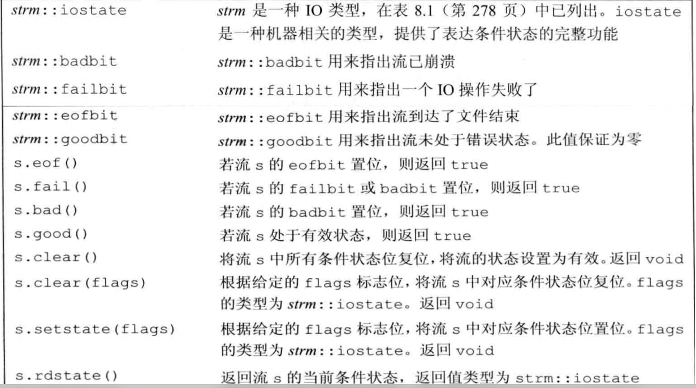

# <center> 第八章: IO 库

---

## 8.1 IO 类

为了支持不同的 IO 操作,C++标准库中除了 iostream(标准输入输出)以外,还提供了 fstream(文件)和 sstream(字符串).他们被包含在各自的头文件中

| 头文件   |                    类型                    |
| -------- | :----------------------------------------: |
| iostream |          istream,ostream,iostream          |
| fstream  |        ifstream,ofstream,iofstream         |
| sstream  | istringstream,ostringstream,iostringstream |

此外,为了支持使用宽字符的语言，标准库定义了一组类型和对象来操纵 wchar_t 类型的数据。宽字符版本的类型和函数的名字以一个 w 开始。例如，wcin、wcout 和 wcerr 是分别对应 cin、cout 和 cerr 的宽字符版对象。宽字符版本的类型和对象与其对应的普通 char 版本的类型定义在同一个头文件中。例如，头文件 fstream 定义了 ifstream 和 wifstream 类型。
由于特殊的机制(继承机制),所有的输入都可以使用>>来进行,无论是从窗口,string 或者一个文件中读入,还是读取字符或者宽字符.
具体来说,继承机制可以使我们声明一个类继承来自另一个类,前者叫做派生类(子类),后者叫做基类(父类).而 C++中,fstream 和 sstream 都是 iostream 的派生类,因此可以使用 cin 从 ifsteram(文件输入流)中读取数据

---

### 8.1.1 IO 中无拷贝和赋值

```cpp
ofstream out1, out2;out1 =out2;//错误:不能对流对象赋值
ofstream print (ofstream) ;//错误:不能初始化ofstream参数
out2 = print (out2);//错误:不能拷贝流对象

```

由于 IO 中没有拷贝和赋值,因此函数中返回值,参数只能是流引用类型,不能是流.并且读写流会改变其状态,因此也不能是 const

### 8.1.2 条件状态

io 可能会发生一些错误,一些错误是可以恢复的,而一些错误发生在系统内部,已经超出可以修正的返回,io 库定义了一个与机器无关的 iostate 类型,包含四个 constexpr 值(位模式),以及一些查询这些状态的函数


一个使用例子:

```cpp
auto old_state = cin.rdstate(); //记住cin的当前状态
cin.clear ();//使cin有效
process_input (cin) ;//使用cin
cin.setstate(old_state);//将cin置为原有状态
```

一个 io 错误的例子:

```cpp
ina ival;
cin>>ival;
```

如果我们在输入中输入 zero,或者是文件结束标志符,当 cin 读取一个,那么这个 cin 的读取就会错误,进入错误状态(上表),因为 cin 输入的对象 int 而我们输入的是 char 类型
一个流一旦发生错误，其上后续的 IO 操作都会失败。只有当一个流处于无错状态时，我们才可以从它读取数据，向它写入数据。由于流可能处于错误状态，因此代码通常应该在使用一个流之前检查它是否处于良好状态。确定一个流对象的状态的最简单的方法是将它当作一个条件来使用:

```cpp
while(cin>>ival)
```

while 循环检查表达式返回的流的状态。如果输入操作成功，流保持有效状态，则条件为真。

### 8.1.3:管理输出缓冲

由于设备的写操作可能很耗时,因此允许系统把多个输出操作合一输出.因此才出现缓冲区.当调用输出时,可能不会立即在输出在显示屏上,而是存放在输出缓冲区,当缓冲区满了或者遇到刷新缓冲命令(例如 endl,flush)就会在屏幕上显示输出.

```cpp
cout << "hi! " <<endl;//输出hi和一个换行,然后刷新缓冲区
cout << "hi !" << flush;// 输出 hi,然后刷新缓冲区,不附加任何额外字符
cout << "hi! " <<ends;//输出hi和一个空字符,然后刷新缓冲区

```

unitbuf 操纵符:每次输出操作后都刷新缓冲区(用 flush).而 nounitbuf 操纵符则重置流，使其恢复使用正常的系统管理的缓冲区刷新机制

```cpp
cout << unitbuf;//任何输出都立即刷新(使用flush)，无缓冲
cout << nounitbuf;//回到正常的缓冲方式
```

此外流的关联也会导致刷新缓冲区,例如默认 cin 和 cerr 都是关联到 cout 上,当调用 cin 或者 cerr 时,cout 就会刷新缓冲区从而打印信息(交互式系统通常应该管理输入流和输出流)
iostream 中定义了 tie 作为关联的成员函数,有两个重载,一个不接受参数,如果没有对象关联到了输出流,那么 cin.tie 返回空指针,如果有,则返回指向关联到输出流的对象的流指针.还有一个版本时接受一个 ostream 流指针,把自己关联到 ostream 上

```cpp
cin.tie ( &cout);//把cin关联到cout上(标准库中已经默认)
// old_tie指向当前关联到cin的流（如果有的话)
ostream *old_tie = cin.tie (nullptr);//cin不再与其他流关联
cin.tie(&cerr);//将cin与 cerr关联;这不是一个好主意，因为cin应该关联到cout.读取cin会刷新cerr而不是cout
cin.tie(old_tie);//重建cin和cout间的正常关联

```

**注意:当程序 异常终止时,缓冲区并不会被刷新,程序输出的数据还可能停留在缓冲区.因此调试一个崩溃的程序时,需要确认缓冲区是否已经刷新**
